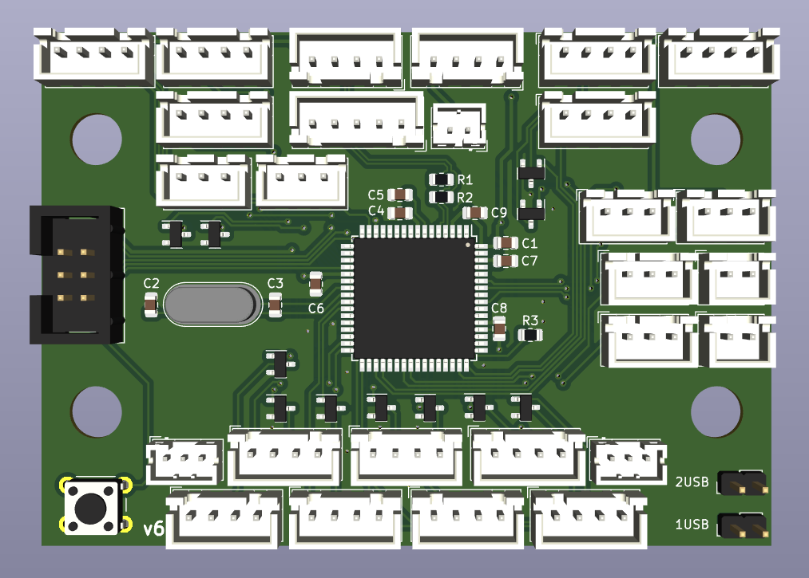
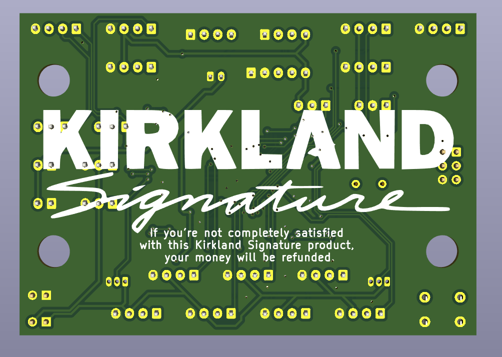
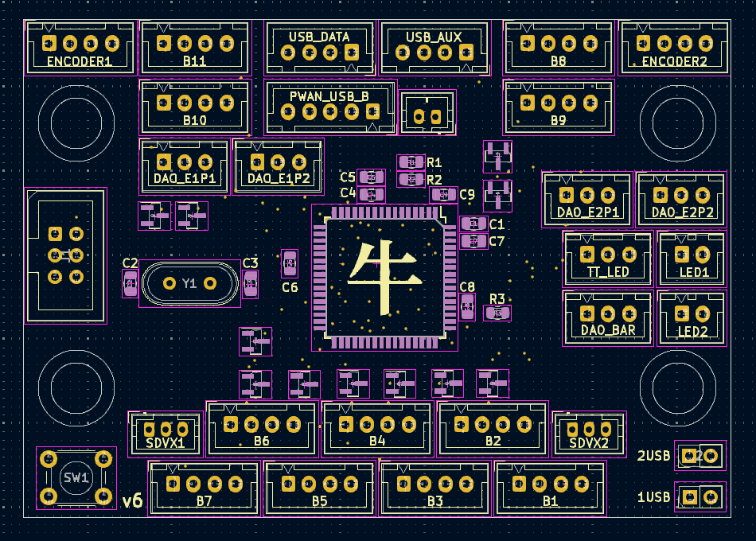
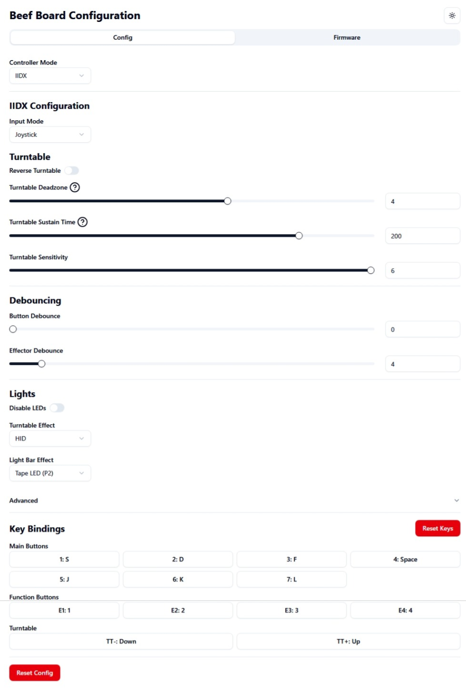
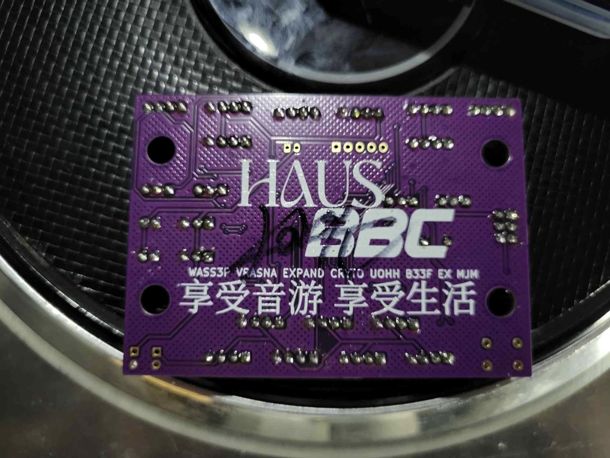

# beef board
[](https://github.com/HWXLR8/beef-board/actions/workflows/ci.yml)

This is a USB I/O PCB for use with Konami Rhythm games. Drop-in support for PHOENIXWAN+ and FAUCETWO controllers. Games currently supported:

* Beatmania IIDX
* Sound Voltex
* Pop'n Music

<p float="left">
  
  
  
</p>

## Wiring configuration

<details>

<summary>IIDX</summary>

| Input | Board label |
|:---|:---|
| B1-7 | Obvious enough |
| E1/Start | B8 |
| E2 | B9 |
| E3 | B10 |
| E4/Select | B11 |
| TT photointerruptor 1 | DAO_E1P1 |
| TT photointerruptor 2 | DAO_E1P2 |
| TT RGB LEDs | TT_LED |
| Bar RGB LEDs | DAO_BAR |

</details>

<details>

<summary>SDVX</summary>

| Input | Board label |
|:---|:---|
| BT-A | B1 |
| BT-B | B2 |
| BT-C | B3 |
| BT-D | B4 |
| FX-L | B5 |
| FX-R | B6 |
| Start | B9 |
| AC-style knobs | SDVX1 and SDVX2 |

</details>

## Configuration

## Web configuration tool

The [web config tool](https://hwxlr8.github.io/beef-board/) allows you to quickly configure multiple settings, reset settings to default values or to launch the bootloader to flash a new firmware.



## Button combos

Alternatively, various configuration options can be changed on-the-fly by holding a button combination. Holding the buttons simultaneously for 1 second will cause the change to take affect. Button lights will momentarily shut off to indicate that the change has occurred.

Refer to these tables for a list of configuration options currently supported:

### IIDX

| Configuration option | Button combination |
|:---|:---|
| Reverse TT direction | B1 + B7 + B8 |
| Change TT lighting effects | B2 + B8 + B11 |
| Increase TT deadzone | B7 + B8 + B11 |
| Decrease TT deadzone | B5 + B8 + B11 |
| Increase TT sensitivity | B3 + B8 + B11 |
| Decrease TT sensitivity | B1 + B8 + B11 |
| Change centre bar lighting effects (PHOENIXWAN only) | B6 + B8 + B10 |
| Disable LEDs | B4 + B8 + B11 |
| Change turntable hue | B2 + B11 + TT |
| Change turntable saturation | B4 + B11 + TT |
| Change turntable brightness | B6 + B11 + TT |

Note: TT deadzone only affects digital TT output.

### SDVX

| Configuration option | Button combination |
|:---|:---|
| Disable LEDs | B1 + B2 + B3 + B4 + B9 |

### Start up

There also exist button combinations which perform special actions if held while connecting the device:

| Special action | Button combination |
|:---|:---|
| Enter programming mode | B1 + B2 |
| IIDX mode - HID (default) | B1 + B8 |
| IIDX mode - Keyboard | B2 + B8 |
| SDVX mode - HID | B1 + B9 |
| SDVX mode - Keyboard | B2 + B9 |

## BOM

```plaintext
### PIN HEADERS ###
1    JST XH 5pin
15   JST XH 4pin
6    JST XH 3pin
2    JST XH 2pin
1    JST PH 2pin
2    JST PH 3pin
2    1x2 2.54mm pin header
1    IDC header 2x3pin 2.54mm (optional)

### MCU ###
1    AT90USB1286 TQFP
1    16MHz crystal (ECS-160-18-4X-CKM)
11   2N7002
1    6mm push button

### CAPACITORS ###
2    1uF 0805
5    100nF 0805
2    10pF 0805

### RESISTORS ###
1    1K 0805
2    22 ohm 0805

### REMOTE BOARD ###
2   JST XH 4pin (angled)
2   USB-B (ED2983-ND)
```

## Credits

* HW design by [HWXLR8](https://github.com/HWXLR8)
* FW written by [HWXLR8](https://github.com/HWXLR8) / [supervaka](https://github.com/supervaka) / [ASleepyCat](https://github.com/ASleepyCat)
* HID implementation provided by the [LUFA project](https://github.com/abcminiuser/lufa)
* Implementation of the WS2812 protocol provided by [FastLED](https://github.com/FastLED/FastLED)
* [kinetic-flow](https://github.com/kinetic-flow)'s [arcin-infinitas](https://github.com/kinetic-flow/arcin-infinitas) for:
  * RGB HID functionality
  * FastLED shims
  * Debounce code
* [dfu-programmer](https://github.com/dfu-programmer/dfu-programmer) for serving as the reference implementation for the Atmel DFU protocol
* Special thanks to Mechada and Cryto for beta testing

# PCB APPROVED BY KORS K



