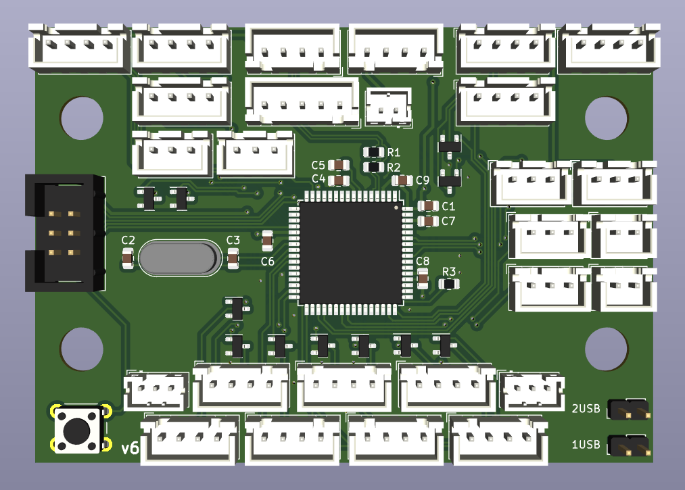
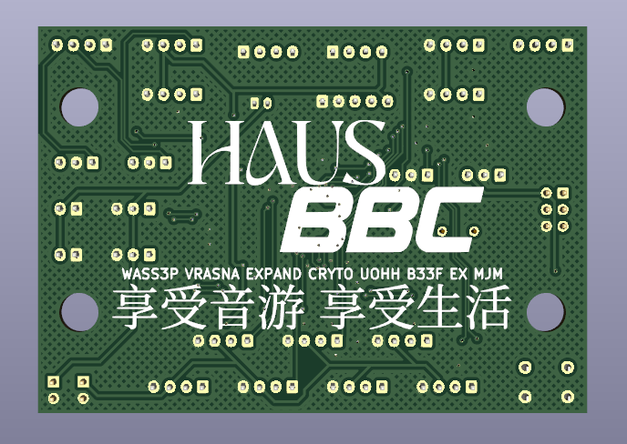

# beef board

  
  
  

This is a USB I/O PCB for use with Konami Rhythm games. Drop-in support for PHOENIXWAN+ and FAUCETWO controllers. Games currently supported:

* Beatmania IIDX
* Sound Voltex
* Pop'n Music

Credits:
* HW design by [HWXLR8](https://github.com/HWXLR8)
* FW written by [supervaka](https://github.com/supervaka)
* HID implementation provided by the [LUFA project](https://github.com/abcminiuser/lufa)
* Implementation of the WS2812 protocol provided by [Tim (cpldcpu)](https://github.com/cpldcpu/light_ws2812).
